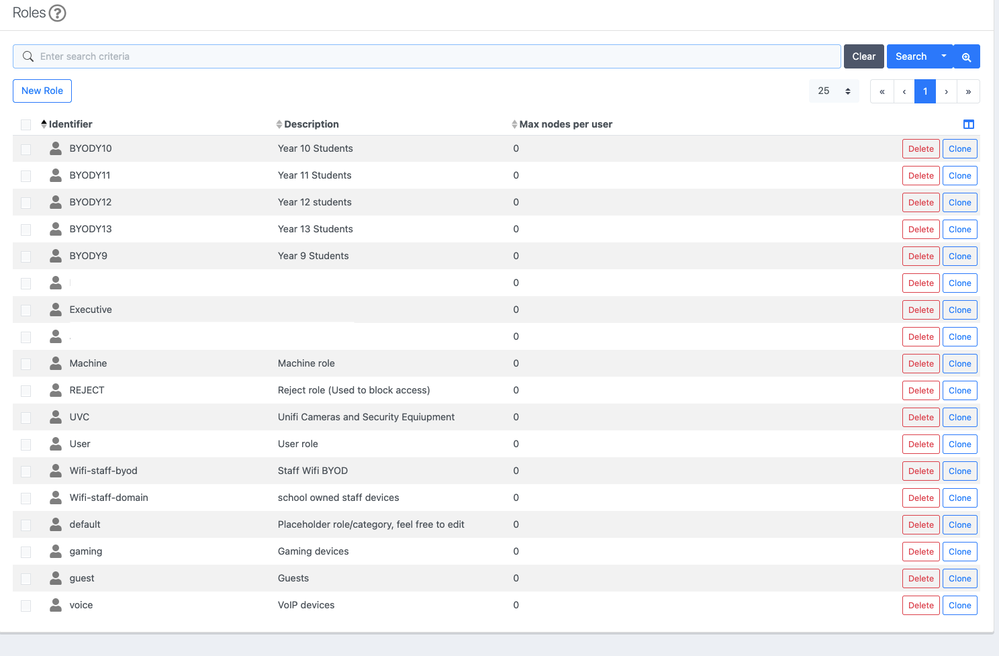
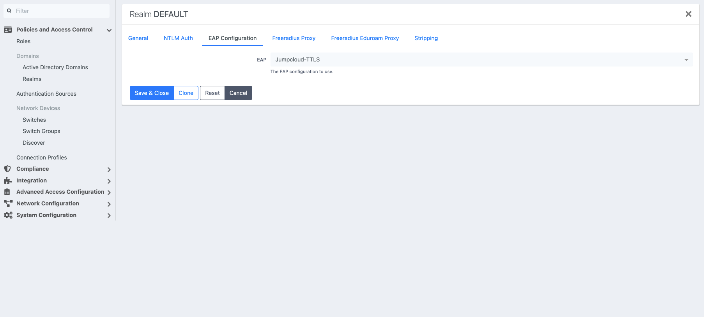
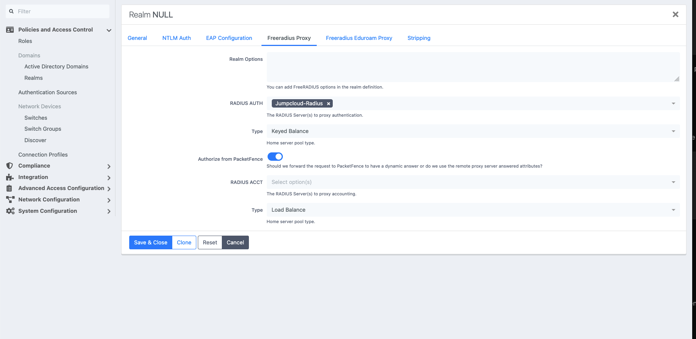
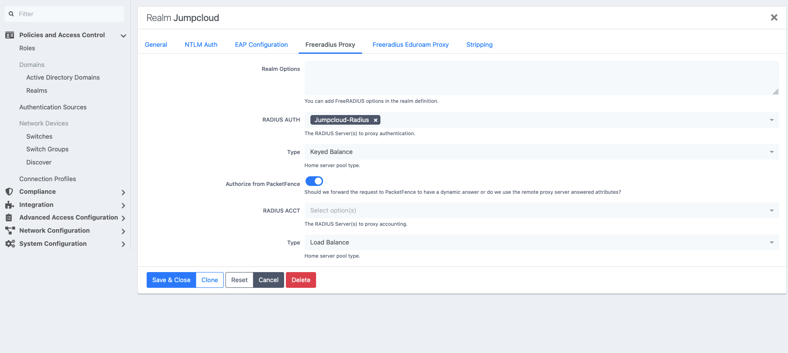
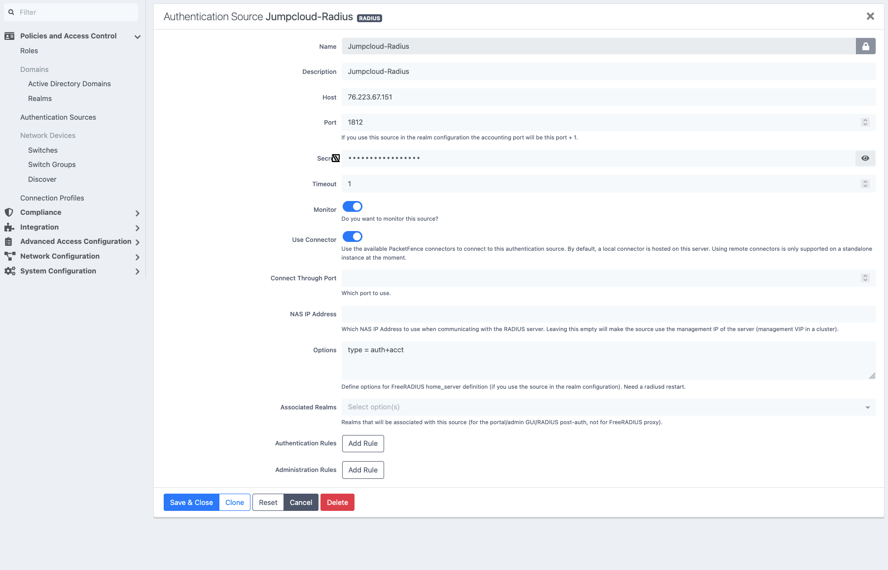
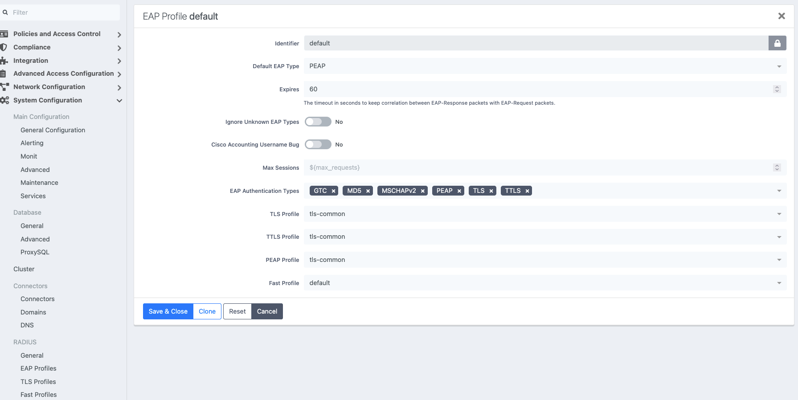
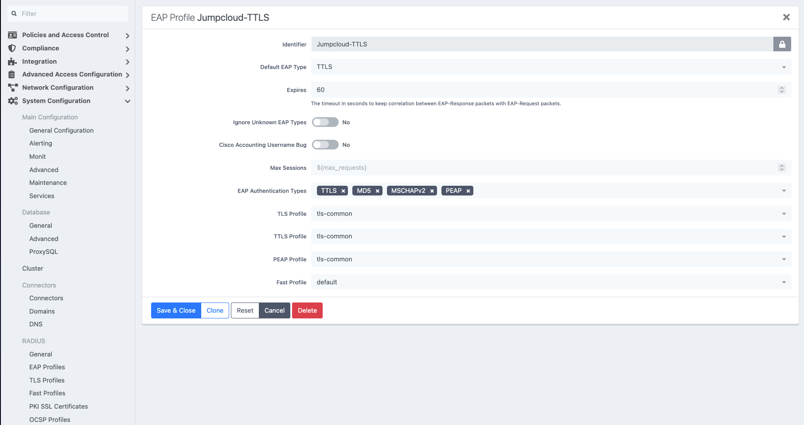
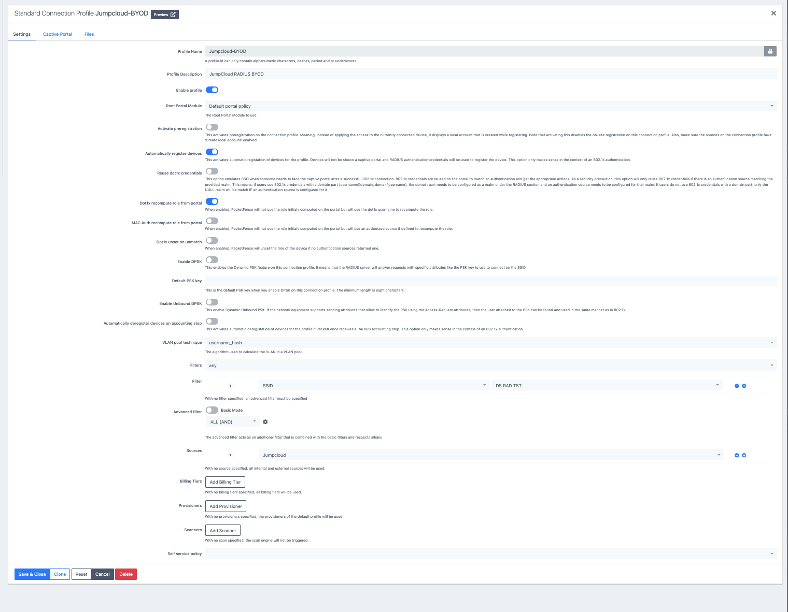
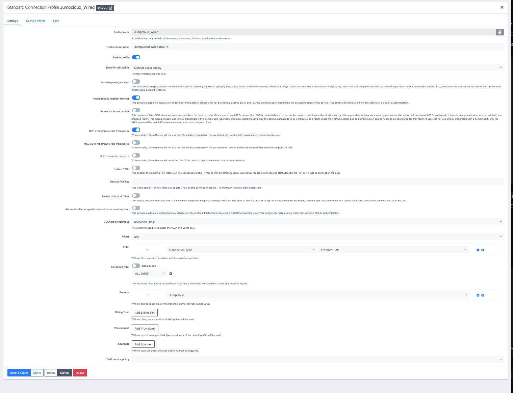
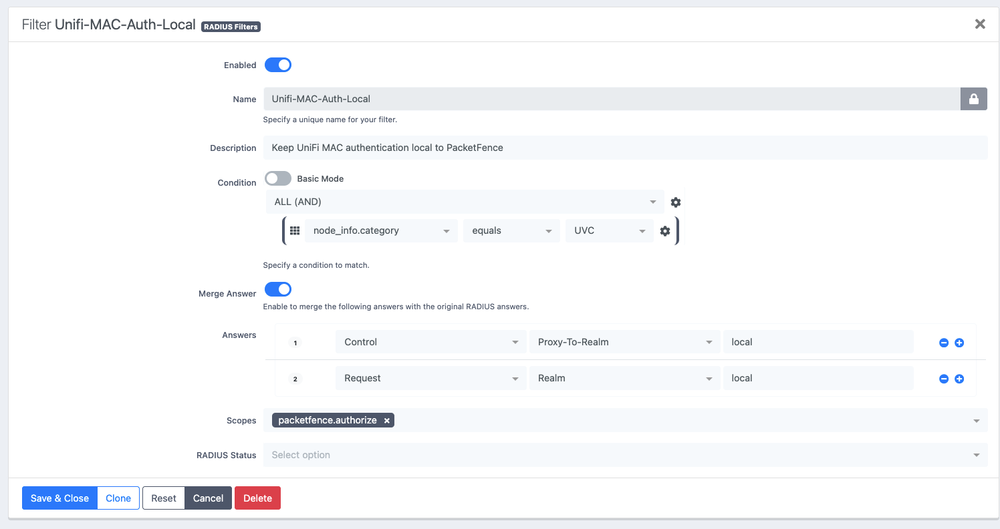

# PacketFence 15 Configuration Guide

This guide documents the PacketFence-side configuration for a working UniFi + JumpCloud NAC design using:

- UniFi wired and wireless infrastructure
- PacketFence 15 as the NAC and policy engine
- JumpCloud RADIUS for credential validation
- JumpCloud LDAP for group membership and authorization
- dynamic VLAN assignment
- local PacketFence MAB for explicitly registered devices

> **Public documentation notice**
>
> All IP addresses, VLAN IDs, usernames, MAC addresses, directory identifiers, group names and organisational role names shown here are examples or placeholders. Do not publish RADIUS shared secrets, LDAP bind credentials, API tokens or production directory identifiers.

---

## 1. Reference Architecture

```text
802.1X Client
    |
    v
UniFi AP / Switch
    |
    | RADIUS 1812 / 1813
    v
PacketFence
    |
    +---- Authentication ----> JumpCloud RADIUS
    |
    +---- Authorization -----> JumpCloud LDAP
    |
    v
PacketFence role / policy
    |
    v
Access-Accept + VLAN attributes
    |
    v
UniFi
```

For registered MAB devices:

```text
Registered IoT device
    |
    v
UniFi switch MAC-based authentication
    |
    v
PacketFence
    |
    | node_info.category == "IoT"
    v
Local PacketFence realm
    |
    v
IoT role / VLAN
```

The design separates responsibilities:

```text
JumpCloud RADIUS
    -> validate credentials

JumpCloud LDAP
    -> expose user/group membership

PacketFence
    -> evaluate rules
    -> assign roles
    -> assign VLANs
    -> enforce policy
```

---

## 2. Example Values

| Setting | Example |
| --- | --- |
| PacketFence server | `192.0.2.10` |
| RADIUS authentication | UDP/1812 |
| RADIUS accounting | UDP/1813 |
| Staff VLAN | `100` |
| Student VLAN | `110` |
| IoT VLAN | `200` |
| Management VLAN | `10` |
| Test username | `testuser` |
| Test MAC | `00:11:22:33:44:55` |

---

# 3. General PacketFence Settings

## Timezone

Set PacketFence to the correct IANA timezone.

Example:

```ini
timezone=Pacific/Auckland
```

Check the effective setting:

```bash
grep -n '^timezone' /usr/local/pf/conf/pf.conf
```

Also confirm the Linux host:

```bash
timedatectl
date
```

Use a named timezone rather than a fixed offset so daylight-saving changes are handled correctly.

---

# 4. Roles



Navigate to:

```text
Configuration
  -> Policies and Access Control
  -> Roles
```

PacketFence roles represent the policy outcome for a user or device.

Typical public examples:

| Identifier | Description | Purpose |
| --- | --- | --- |
| `Staff` | Staff users | General staff access |
| `Privileged-Staff` | Privileged staff | Higher-trust access |
| `Students-9` | Year 9 students | Student cohort access |
| `Students-10` | Year 10 students | Student cohort access |
| `Students-11` | Year 11 students | Student cohort access |
| `Students-12` | Year 12 students | Student cohort access |
| `Students-13` | Year 13 students | Student cohort access |
| `IoT` | Cameras/security devices | Local MAB devices |
| `Machine` | Generic machine role | Device access |
| `REJECT` | Reject role | Explicit deny |
| `Guest` | Guest users | Guest access |
| `Voice` | VoIP devices | Voice access |

The tested roles use:

```text
Max nodes per user = 0
```

Role design principles:

1. Create distinct roles for materially different access policies.
2. Keep user roles separate from MAB/device roles.
3. Put privileged populations in explicit roles.
4. Avoid relying on `default` as a catch-all.
5. Remove temporary test roles before production.
6. Keep role-to-VLAN mappings simple and predictable.

---

# 5. Realms

Navigate to:

```text
Configuration
  -> Policies and Access Control
  -> Domains
  -> Realms
```

The tested design uses three relevant realms:

- `DEFAULT`
- `NULL`
- `Jumpcloud`

## DEFAULT Realm



Under:

```text
Realm DEFAULT
  -> EAP Configuration
```

configure:

| Setting | Value |
| --- | --- |
| EAP | `Jumpcloud-TTLS` |

This selects the dedicated JumpCloud EAP profile for the default EAP processing path.

## NULL Realm



Under:

```text
Realm NULL
  -> Freeradius Proxy
```

configure:

| Setting | Value |
| --- | --- |
| RADIUS AUTH | `Jumpcloud-Radius` |
| Type | `Keyed Balance` |
| Authorize from PacketFence | Enabled |
| RADIUS ACCT | Not configured |
| Accounting Type | `Load Balance` |

Normal usernames without an explicit realm suffix use the NULL realm.

The important settings are:

```text
RADIUS AUTH = Jumpcloud-Radius
Authorize from PacketFence = Enabled
```

This means JumpCloud validates credentials, while PacketFence still makes the final authorization decision.

## Jumpcloud Realm



Under:

```text
Realm Jumpcloud
  -> Freeradius Proxy
```

configure:

| Setting | Value |
| --- | --- |
| RADIUS AUTH | `Jumpcloud-Radius` |
| Type | `Keyed Balance` |
| Authorize from PacketFence | Enabled |
| RADIUS ACCT | Not configured |
| Accounting Type | `Load Balance` |

The tested design therefore maps both realms to the same upstream RADIUS source:

```text
NULL      -> Jumpcloud-Radius
Jumpcloud -> Jumpcloud-Radius
```

with local PacketFence authorization enabled.

## Why "Authorize from PacketFence" is enabled

Conceptually:

```text
JumpCloud:
"Are these credentials valid?"

PacketFence:
"What network access should this identity receive?"
```

PacketFence must remain responsible for role and VLAN assignment.

## Do not alter NULL realm globally for MAB

The NULL realm is part of the known-good PEAP authentication path.

MAB should instead be redirected selectively with:

```text
control:Proxy-To-Realm = local
request:Realm = local
```

---

# 6. JumpCloud RADIUS Authentication Source



Navigate to:

```text
Configuration
  -> Policies and Access Control
  -> Authentication Sources
```

Create a RADIUS source named:

```text
Jumpcloud-Radius
```

Example public configuration:

| Setting | Value |
| --- | --- |
| Name | `Jumpcloud-Radius` |
| Description | `Jumpcloud-Radius` |
| Host | `<JUMPCLOUD_RADIUS_HOST>` |
| Port | `1812` |
| Secret | `<RADIUS_SHARED_SECRET>` |
| Timeout | `1` |
| Monitor | Enabled |
| Use Connector | Enabled |
| Connect Through Port | Not set |
| NAS IP Address | Not set |
| Options | `type = auth+acct` |
| Associated Realms | Not required here |
| Authentication Rules | None |
| Administration Rules | None |

The source is referenced by the realms under `RADIUS AUTH`.

The tested source uses:

```text
UDP/1812
```

and the home-server option:

```text
type = auth+acct
```

The RADIUS source itself does not contain PacketFence authorization rules. Those live on the LDAP source.

---

# 7. JumpCloud LDAP Authentication Source

Navigate to:

```text
Configuration
  -> Policies and Access Control
  -> Authentication Sources
```

Create an LDAP source named:

```text
Jumpcloud
```

Example public configuration:

| Setting | Value |
| --- | --- |
| Name | `Jumpcloud` |
| Description | `Jumpcloud` |
| Host | `<JUMPCLOUD_LDAP_HOST>` |
| Port | `636` |
| Encryption | `SSL` |
| SSL Verify Mode | `none` |
| Dead duration | `60` |
| Connection timeout | `1` |
| Request timeout | `5` |
| Response timeout | `10` |
| Scope | `Subtree` |
| Username Attribute | `uid` |
| Email Attribute | `mail` |
| Cache match | Enabled |
| Monitor | Enabled |
| Shuffle | Disabled |
| Use Connector | Enabled |

## Base DN

Example:

```text
ou=Users,o=<JUMPCLOUD_ORG_ID>,dc=jumpcloud,dc=com
```

## Bind DN

Example:

```text
uid=<LDAP_BIND_USER>,ou=Users,o=<JUMPCLOUD_ORG_ID>,dc=jumpcloud,dc=com
```

The password must remain private.

## SSL verification

The tested configuration uses:

```text
SSL Verify Mode = none
```

For production, certificate verification should be enabled where possible and the required CA chain trusted.

## Connector use

The tested source has:

```text
Use Connector = Enabled
```

In containerised PacketFence deployments, validate DNS and LDAP reachability from the PacketFence service/connector context, not just from the Linux host.

Useful checks:

```bash
dig ldap.jumpcloud.com
getent hosts ldap.jumpcloud.com
```

---

# 8. LDAP Authentication Rules

The JumpCloud LDAP source contains rules that map directory group membership to PacketFence roles.

The tested rules cover categories such as:

- privileged users
- staff BYOD
- student year groups
- general Wi-Fi users

A representative rule uses:

```text
LDAP attribute: memberOf
Operator:       equals
Value:          cn=Staff,ou=Users,o=<JUMPCLOUD_ORG_ID>,dc=jumpcloud,dc=com
```

and applies:

```text
Role = Staff
```

A rule may also set an access duration.

One tested rule used:

```text
Access duration = 5 days
```

## Rule matching

The tested rules use:

```text
Matches = All
```

so all conditions in a rule must match.

## Rule ordering

More specific rules should be above broad rules.

Example:

```text
1. Privileged Staff
2. Specialist Staff
3. Student cohorts
4. Staff BYOD
5. General Wi-Fi Users
```

This prevents a broad group from matching before a more specific group can assign the correct role.

---

# 9. EAP Profiles

Navigate to:

```text
Configuration
  -> System Configuration
  -> RADIUS
  -> EAP Profiles
```

Two relevant profiles exist:

- `default`
- `Jumpcloud-TTLS`

## default EAP Profile



| Setting | Value |
| --- | --- |
| Identifier | `default` |
| Default EAP Type | `PEAP` |
| Expires | `60` |
| Ignore Unknown EAP Types | `No` |
| Cisco Accounting Username Bug | `No` |
| Max Sessions | `${max_requests}` |
| EAP Authentication Types | `GTC`, `MD5`, `MSCHAPv2`, `PEAP`, `TLS`, `TTLS` |
| TLS Profile | `tls-common` |
| TTLS Profile | `tls-common` |
| PEAP Profile | `tls-common` |
| Fast Profile | `default` |

## Jumpcloud-TTLS EAP Profile



| Setting | Value |
| --- | --- |
| Identifier | `Jumpcloud-TTLS` |
| Default EAP Type | `TTLS` |
| Expires | `60` |
| Ignore Unknown EAP Types | `No` |
| Cisco Accounting Username Bug | `No` |
| Max Sessions | `${max_requests}` |
| EAP Authentication Types | `TTLS`, `MD5`, `MSCHAPv2`, `PEAP` |
| TLS Profile | `tls-common` |
| TTLS Profile | `tls-common` |
| PEAP Profile | `tls-common` |
| Fast Profile | `default` |

The `DEFAULT` realm is explicitly configured to use `Jumpcloud-TTLS`.

The dedicated profile is narrower than the built-in default profile and makes TTLS the default EAP method.

## Operational guidance

- Keep `Jumpcloud-TTLS` associated with the `DEFAULT` realm.
- Do not remove `MSCHAPv2` or `PEAP` while clients still depend on them.
- Review whether `MD5` is actually required before production use.
- Changes to `tls-common` can affect PEAP, TTLS and TLS authentication.

---

# 10. Connection Profiles

Navigate to:

```text
Configuration
  -> Policies and Access Control
  -> Connection Profiles
```

The tested design separates wireless BYOD and wired 802.1X.

Both profiles use the same JumpCloud LDAP authentication source.

## Wireless BYOD Profile



Example:

| Setting | Value |
| --- | --- |
| Profile Name | `Jumpcloud-BYOD` |
| Profile Description | `JumpCloud RADIUS BYOD` |
| Enable profile | Enabled |
| Root Portal Module | `Default portal policy` |
| Activate preregistration | Disabled |
| Automatically register devices | Enabled |
| Reuse dot1x credentials | Disabled |
| Dot1x recompute role from portal | Enabled |
| MAC Auth recompute role from portal | Disabled |
| Dot1x unset on unmatch | Disabled |
| Enable DPSK | Disabled |
| Enable Unbound DPSK | Disabled |
| Automatically deregister devices on accounting stop | Disabled |
| VLAN pool technique | `username_hash` |
| Filters | `any` |
| Authentication Source | `Jumpcloud` |

Wireless profile filter:

```text
SSID = <WIRELESS_SSID>
```

Public example:

```text
SSID = CORP-BYOD
```

## Wired 802.1X Profile



Example:

| Setting | Value |
| --- | --- |
| Profile Name | `Jumpcloud_Wired` |
| Profile Description | `JumpCloud Wired 802.1X` |
| Enable profile | Enabled |
| Root Portal Module | `Default portal policy` |
| Activate preregistration | Disabled |
| Automatically register devices | Enabled |
| Reuse dot1x credentials | Disabled |
| Dot1x recompute role from portal | Enabled |
| MAC Auth recompute role from portal | Disabled |
| Dot1x unset on unmatch | Disabled |
| Enable DPSK | Disabled |
| Enable Unbound DPSK | Disabled |
| Automatically deregister devices on accounting stop | Disabled |
| VLAN pool technique | `username_hash` |
| Filters | `any` |
| Authentication Source | `Jumpcloud` |

Wired profile filter:

```text
Connection Type = Ethernet-EAP
```

This is intentionally different from the problematic RADIUS authorize-stage condition `Ethernet-NoEAP`.

## Why separate wired and wireless profiles

Separate profiles make it easier to:

- match access methods independently
- troubleshoot profile selection
- change wired or wireless policy independently
- add future access-method-specific behaviour

---

# 11. Normal 802.1X Flow

The final user flow is:

```text
Client
  |
  | PEAP / TTLS / MSCHAPv2
  v
UniFi
  |
  v
PacketFence connection profile
  |
  v
DEFAULT EAP processing
  |
  v
Jumpcloud-TTLS
  |
  v
NULL / Jumpcloud realm
  |
  v
Jumpcloud-Radius
  |
  v
JumpCloud RADIUS
  |
  | Access-Accept
  v
PacketFence
  |
  v
JumpCloud LDAP source
  |
  v
memberOf rule
  |
  v
PacketFence role
  |
  v
Dynamic VLAN
```

A typical final response includes:

```text
Tunnel-Type = VLAN
Tunnel-Medium-Type = IEEE-802
Tunnel-Private-Group-Id = "<VLAN ID>"
```

---

# 12. MAC Authentication Bypass

MAB is used for endpoints that cannot perform normal 802.1X.

Recommended design:

1. Register the endpoint in PacketFence.
2. Assign an explicit device category.
3. Configure the UniFi switch port for MAC-based authentication.
4. Keep that category local to PacketFence.

Example:

```text
MAC:      00:11:22:33:44:55
Status:   Registered
Category: IoT
```

Example role mapping:

```text
IoT -> VLAN 200
```

---

# 13. MAB RADIUS Authorize Filter



The working authorize filter is:

```ini
[Unifi-MAC-Auth-Local]
scopes=packetfence.authorize
status=enabled
top_op=and
description=Keep UniFi MAC authentication local to PacketFence
merge_answer=yes
condition=node_info.category == "IoT"
answer.0=control:Proxy-To-Realm = local
answer.1=request:Realm = local
```

The effective filter configuration can be inspected in:

```text
/usr/local/pf/conf/radius_filters.conf
```

Both realm assignments are required:

```text
control:Proxy-To-Realm = local
request:Realm = local
```

Setting only `Proxy-To-Realm` was not sufficient in testing because the request could retain `Realm = null` and still follow the JumpCloud proxy path.

## Why use node category

The condition:

```text
node_info.category == "IoT"
```

makes local MAB an explicit trust decision.

Unknown devices are not automatically trusted simply because they present a MAC-shaped username.

---

# 14. MAB Approaches That Failed or Were Rejected

## `connection_type = Ethernet-NoEAP`

Do not use this as the sole early authorize-stage MAB detector.

During testing it also caught legitimate wired PEAP traffic before the inner EAP/MSCHAPv2 exchange had completed.

## MAC-shaped username matching

Example:

```text
radius_request.User-Name == "001122334455"
```

Useful for troubleshooting, but not a scalable production policy.

## Service-Type alone

Attributes such as `Call-Check` can help identify MAB during debugging, but the resolved PacketFence node category proved to be a more reliable policy decision point.

---

# 15. Dynamic VLAN Requirements

PacketFence returns standard RADIUS tunnel attributes:

```text
Tunnel-Type = VLAN
Tunnel-Medium-Type = IEEE-802
Tunnel-Private-Group-Id = "<VLAN ID>"
```

Every VLAN PacketFence can return must:

- exist on the network
- be allowed across required trunks
- reach the AP or access switch
- have working DHCP
- have the correct gateway/firewall policy

A correct PacketFence Access-Accept cannot compensate for a missing VLAN on the switching path.

---

# 16. RADIUS Accounting

UniFi sends accounting directly to PacketFence on:

```text
UDP/1813
```

The realm configuration does not need to proxy accounting upstream in the documented design.

Use PacketFence accounting and RADIUS audit data to correlate session state and authentication results.

---

# 17. RADIUS Audit Log Timestamp Issue

PacketFence 15 was observed serializing a local `radius_audit_log.created_at` value as though it were already UTC.

Example:

```text
Database:
2026-10-08 09:03:58

Incorrect API representation:
2026-10-08T09:03:58Z
```

With a `Pacific/Auckland` browser during NZDT, the GUI then displayed the time 13 hours ahead.

The investigation showed:

```text
RADIUS Event-Timestamp    correct local time
MariaDB created_at        correct local time
DAL find()                correct local time
DAL search()              correct local time
Unified API               local value incorrectly marked with Z
Browser                   applies timezone conversion
GUI                       incorrect
```

Affected controller:

```text
/usr/local/pf/lib/pf/UnifiedApi/Controller/RadiusAuditLogs.pm
```

The local workaround converts the stored local timestamp into real UTC before API serialization.

After modifying the controller, restart both:

```bash
systemctl restart packetfence-pfperl-api
systemctl restart packetfence-api-frontend
```

Do not work around this bug by changing the server or PacketFence timezone.

An upstream fix was prepared for the PacketFence project.

---

# 18. Service and Troubleshooting Checks

## RADIUS service

```bash
systemctl status packetfence-radiusd-auth --no-pager -l
```

## API services

```bash
systemctl status packetfence-pfperl-api --no-pager -l
systemctl status packetfence-api-frontend --no-pager -l
```

## Time

```bash
timedatectl
date
grep -n '^timezone' /usr/local/pf/conf/pf.conf
```

## RADIUS traffic

```bash
tcpdump -ni any -s0 'udp port 1812 or udp port 1813'
```

## Generated realm configuration

```bash
grep -n -A8 -B2 '^realm ' /usr/local/pf/raddb/proxy.conf.inc
```

## RADIUS filters

```bash
cat /usr/local/pf/conf/radius_filters.conf
```

---

# 19. Troubleshooting Order

Work through the path in this order:

```text
1. Did UniFi send the RADIUS request?
2. Did PacketFence receive it?
3. Which connection profile matched?
4. Which EAP profile was selected?
5. Which realm did PacketFence select?
6. Was the request local or proxied?
7. Did JumpCloud RADIUS authenticate the user?
8. Did JumpCloud LDAP return the expected group membership?
9. Which PacketFence authentication rule matched?
10. Which PacketFence role was assigned?
11. Which VLAN attributes were returned?
12. Did UniFi apply the VLAN?
13. Did the endpoint receive DHCP and usable connectivity?
```

Treat these as separate stages:

```text
authentication
    != authorization
    != role selection
    != VLAN assignment
    != network transport
```

---

# 20. Known-Good Design Rules

The final implementation follows these principles:

1. UniFi sends RADIUS to PacketFence.
2. PacketFence proxies normal user authentication to JumpCloud RADIUS.
3. JumpCloud LDAP supplies group information for PacketFence policy.
4. The NULL realm remains part of the working user authentication path.
5. PacketFence remains responsible for authorization and VLAN assignment.
6. Wired and wireless access use separate connection profiles.
7. Registered MAB devices are identified using `node_info.category`.
8. MAB overrides both `Proxy-To-Realm` and `Realm` to `local`.
9. Unknown MAB endpoints are not automatically trusted.
10. Authentication rules are ordered from most specific to least specific.
11. Dynamic VLANs are validated end-to-end across the network.
12. Site-specific source-code workarounds should be replaced by upstream fixes where possible.

---

## Security Notes

- Never commit RADIUS shared secrets.
- Never commit JumpCloud LDAP bind passwords.
- Never commit API keys or service-account credentials.
- Avoid publishing production directory identifiers.
- Use documentation-only IP addresses and MAC addresses in public examples.
- Review `SSL Verify Mode = none` before production.
- Review whether EAP-MD5 is actually required.
- Prefer explicit MAB registration/category assignment over implicit trust.

---

## Related Documentation

- [UniFi configuration](unifi-configuration.md)
- [Project overview](../README.md)
