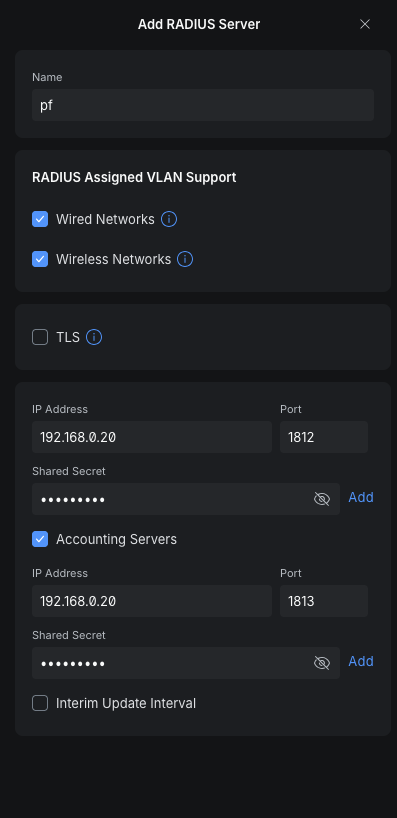
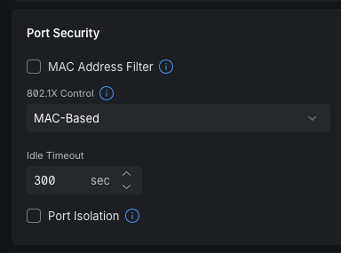

# UniFi Configuration for PacketFence

This page documents the UniFi-side configuration used to send 802.1X and MAC-based authentication requests to PacketFence.

> **Public documentation notice**
>
> IP addresses, VLAN IDs and other environment-specific values shown in this guide have been replaced with documentation examples. RADIUS shared secrets must never be published.

---

## 1. Create the PacketFence RADIUS Profile

In UniFi Network, create a RADIUS profile for PacketFence.

Example profile name:

```text
packetfence
```



### RADIUS Assigned VLAN Support

Enable RADIUS-assigned VLAN support for both:

- **Wired Networks**
- **Wireless Networks**

This allows PacketFence to return standard RADIUS tunnel attributes such as:

```text
Tunnel-Type = VLAN
Tunnel-Medium-Type = IEEE-802
Tunnel-Private-Group-Id = "<VLAN ID>"
```

and have UniFi apply the returned VLAN to the authenticated endpoint.

### TLS

Leave **TLS disabled** when using standard RADIUS over UDP.

The tested configuration uses:

```text
Authentication: UDP/1812
Accounting:     UDP/1813
```

### Authentication Server

Add the PacketFence server as the authentication server.

Example:

| Setting | Value |
| --- | --- |
| IP Address | `192.0.2.10` |
| Port | `1812` |
| Shared Secret | `<RADIUS_SHARED_SECRET>` |

The shared secret must exactly match the secret configured for the corresponding UniFi NAS/network device in PacketFence.

Do not commit the real secret to source control.

### Accounting Server

Enable **Accounting Servers** and configure the same PacketFence server.

Example:

| Setting | Value |
| --- | --- |
| IP Address | `192.0.2.10` |
| Port | `1813` |
| Shared Secret | `<RADIUS_SHARED_SECRET>` |

RADIUS accounting provides PacketFence with session information after authentication.

### Interim Update Interval

The tested configuration leaves **Interim Update Interval disabled**.

This is not required for the basic authentication and dynamic VLAN workflow.

### Resulting RADIUS Path

```text
UniFi AP / Switch
       |
       +---- UDP/1812 ----> PacketFence authentication
       |
       +---- UDP/1813 ----> PacketFence accounting
```

PacketFence then proxies normal user authentication to the configured identity provider and returns the final role/VLAN information to UniFi.


## 2. MAC Authentication Bypass on UniFi Switch Ports

For devices that cannot perform normal 802.1X authentication, configure the applicable UniFi switch port for MAC-based authentication.

Open the switch port's **Port Security** settings and configure:

| Setting | Value |
| --- | --- |
| MAC Address Filter | Disabled |
| 802.1X Control | `MAC-Based` |
| Idle Timeout | `300 seconds` |
| Port Isolation | Disabled |



With `802.1X Control` set to `MAC-Based`, UniFi uses the connected device's MAC address as the identity presented to RADIUS.

The authentication flow is:

```text
Device
  |
  | MAC address
  v
UniFi switch port
  |
  | MAC-based RADIUS authentication
  v
PacketFence
  |
  | node_info.category == "UVC"
  v
Unifi-MAC-Auth-Local filter
  |
  +-- Proxy-To-Realm = local
  +-- Realm = local
  |
  v
PacketFence local policy
  |
  v
UVC role / assigned VLAN
```

The endpoint must already be registered in PacketFence and assigned to the expected category:

```text
Category = UVC
```

PacketFence then matches the local MAB authorize filter and prevents the request from being proxied to JumpCloud RADIUS.

Normal wired 802.1X clients should continue to use the `Ethernet-EAP` connection profile rather than MAC-based authentication.
